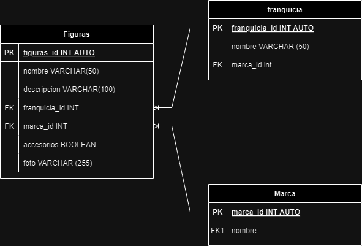

# Figuras

## Listado de entidades

### figuras **(ED)**

- figura_id **(PK)**
- nombre
- descripcion
- franquicia **(FK)**
- marca **(FK)**
- accesorios
- foto

### franquicias **(EC)**
- franquicia_id **(PK)**
- nombre

### marcas **(EC)**

- marca_id **(PK)**
- nombre

## Relaciones

1. Una **figura** _pertenece_ a una **franquicia**. (_1 a 1_)
2. Una **figura** es _hecha_ por varías marcas **marca**. (_1 a N_)
3. Una **marca** _hace_ muchas **figuras**. (_1 a N_)

## Diagramas

### Modelo Entidad-Relación

### Modelo Relacional de la base de datos

## Reglas de negocio

### figuras

1. Crear el registo de una figura.
2. Leer el registro de una(s) figura(s) dada una condición en particular.
3. Leer todos los registros de la entidad figuras.
4. Actualizar los datos de una figura dada una condición en particular.
5. Eliminar los registros de una figura dada una condición en particular.

### franquicias

1. Crear el registo de una franquicia.
2. Leer el registro de una(s) franquicia(s) dada una condición en particular.
3. Leer todos los registros de la entidad franquicias.
4. Actualizar los datos de una franquicia dada una condición en particular.
5. Eliminar los registros de una franquicia dada una condición en particular.

### marca

1. Crear el registo de una marca.
2. Leer el registro de una(s) marca(s) dada una condición en particular.
3. Leer todos los registros de la entidad marca.
4. Actualizar los datos de una marca dada una condición en particular.
5. Eliminar los registros de una marca dada una condición en particular.

## Autor

- [Alexis Flores]()