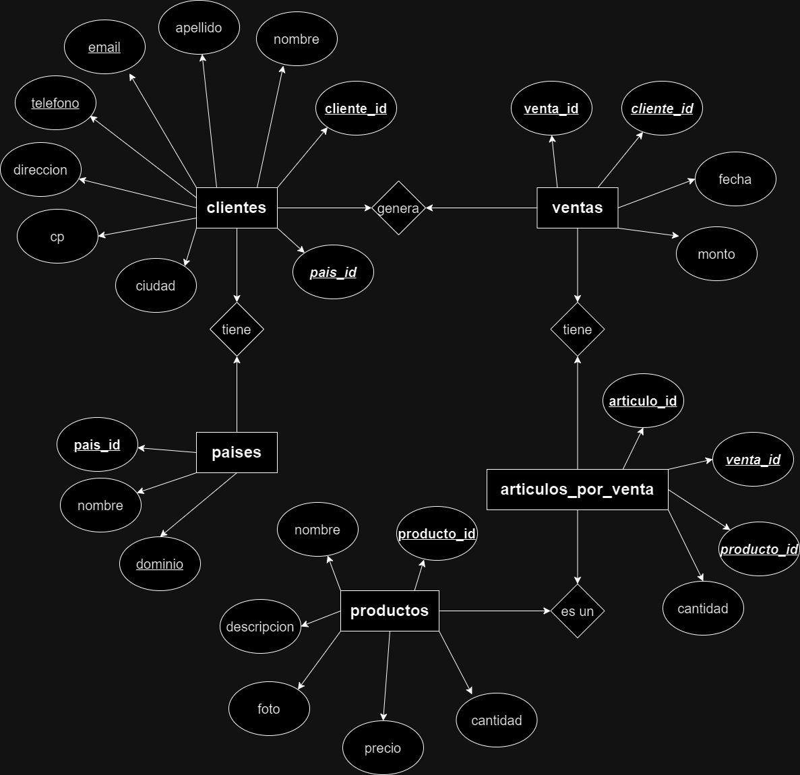
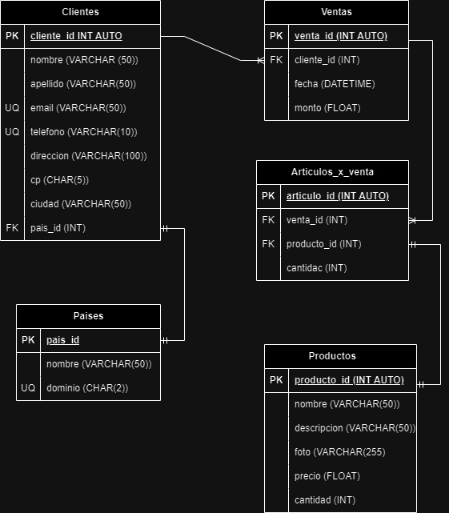

# Ventas

## Listado de entidades

### clientes **(ED)**

- cliente_id **(PK)**
- nombre
- apellido
- email **(UQ)**
- telefono **(UQ)**
- direccion
- cp
- ciudad
- pais **(FK)**

### productos **(ED/EC)**

- producto_id **(PK)**
- nombre
- descripcion
- foto
- precio
- cantidad

### ventas

- venta_id **(PK)**
- cliente_id **(FK)**
- fecha
- monto

### articulos_por_venta **(EP)**

- articulo_id **(PK)**
- venta_id **(FK)**
- producto_id **(FK)**
- cantidad

### paises **(EC)**

- pais_id **(PK)**
- nombre
- dominio **(UQ)**

## Relaciones

1. Un cliente tiene **pais** (_1 a 1_)
2. Una **cliente** genera **ventas** (_1 a M_)
3. Una **venta** tiene **articulos** (_1 a M_)
4. Un **articulo** es un **producto** (_1 a 1_)

## Diagramas

### Modelo entidad-relación

### Modelo Relacional de la base de datos

## Reglas de negocio

### Clientes

1. Crear un cliente.
2. Leer todos los clientes.
3. Leer un cliente en particular.
4. Actualizar un cliente.
5. Eliminar un cliente.

### Productos

1. Crear un producto.
2. Leer todos los productos.
3. Leer un producto en particular.
4. Actualizar un producto.
5. Eliminar un producto.
6. Cada que haya una venta, restar a la cantidad de productos. disponibles, el número de artículos que se vendieron.

### Ventas

1. Crear una venta.
2. Leer todas las ventas.
3. Leer una venta en particular.
4. Leer todas las ventas de un cliente.
5. Leer todas las ventas de un producto.
6. Actualizar una venta.
7. Eliminar una venta.

### Artículos por venta

1. Crear un artículo.
2. Leer todos los artículos.
3. Leer un artículo en particular.
4. Leer todos los articulos de una venta.
5. Leer todos los articulos de un producto.
6. Leer todos los articulos de un cliente.
4. Actualizar un artículo por venta.
5. Eliminar un artículo por venta.

### Paises

1. Crear un país.
2. Leer todos los países.
3. Leer un país en particular.
4. Actualizar un país.
5. Eliminar un país.
